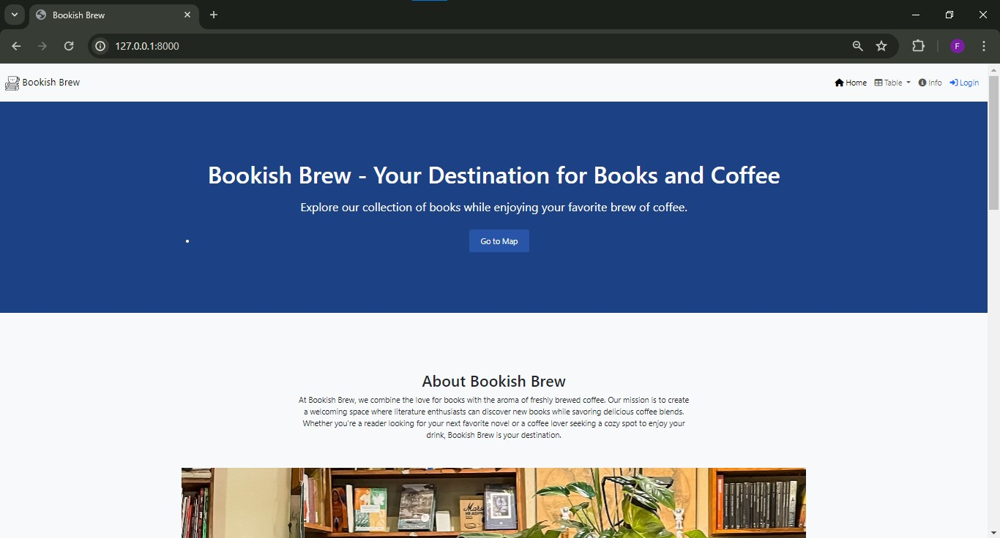
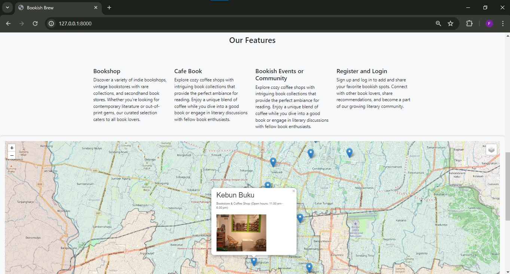
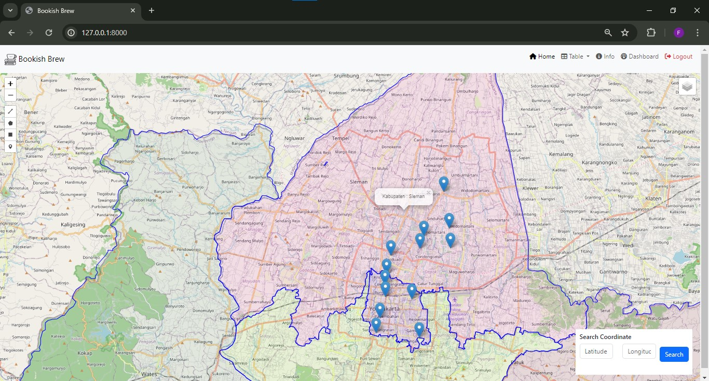

# bookish-brew

Bookish Brew is a web application designed for book enthusiasts to explore, share, and engage with their favorite books and literary interests. It provides a platform where users can discover new books, connect with fellow readers, and participate in discussions about literature.

## Built With

- **Laravel**: PHP web application framework for robust backend development.
- **jQuery & Bootstrap 5**: Frontend frameworks for responsive interface building.
- **FontAwesome & Flaticon**: Library for high-quality icons used throughout the application.
- **Leaflet Draw**: Leaflet plugin enabling drawing and editing of spatial data on maps.
- **PostgreSQL & PostGIS**: Database management system for handling geospatial data.
- **QGIS**: Integration for advanced geospatial data analysis and visualization.
- **GeoServer**: WebGIS server for publishing geospatial data and services.
- **DataTables**: JavaScript library for displaying and interacting with data tables in the WebGIS environment.

## Preview

## Bookish Brew Preview

